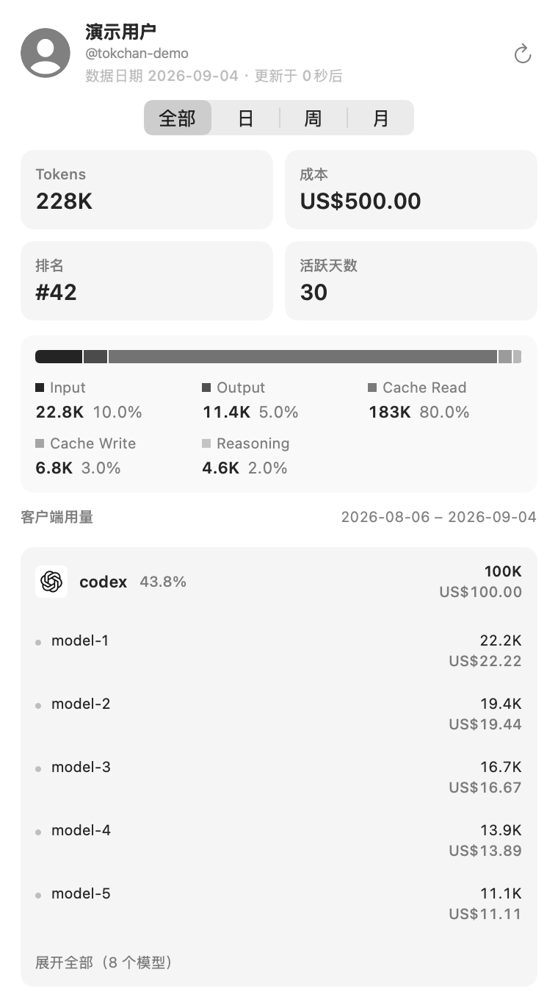

<p align="center">
  
</p>

<h1 align="center">TokChan</h1>

<p align="center">把 Tokscale 的用量统计与常用操作放进 macOS 菜单栏</p>

<p align="center">
  <a href="https://github.com/youranreus/TokChan/releases/latest"></a>
  
  
</p>

<p align="center">
  
</p>

<p align="center"><sub>截图使用应用内置演示数据</sub></p>

## 这是什么

TokChan 是一款原生 macOS 菜单栏应用，用来查看 [Tokscale](https://tokscale.ai) 的本地或在线 AI 编程工具用量。打开菜单栏面板，就能看到 Tokens、成本，以及客户端和模型明细；在线模式还会显示排名和活跃天数。提交数据、管理自动提交和维护自定义价格，也可以在同一个界面里完成。

它适合已经在使用 Tokscale，又希望少开几次终端的人。应用没有 Dock 图标，平时安静地待在菜单栏，需要时点开即可。

### 目前支持

- 在本地数据与在线公开资料之间切换，首次启动默认本地模式
- 查看全部、今天、最近 7 天和最近 30 天四个统计范围
- 在“设置 → 展示配置”中选择打开面板时的默认时间范围
- 查看总 Tokens 和总成本；在线模式额外显示排名和活跃天数
- 区分输入、输出、缓存读取、缓存写入和推理五类 Token
- 按客户端和模型查看用量，较长列表可以展开
- 自定义菜单栏文字，可选择统计范围，并使用 `{token}` 和 `{cost}` 占位符
- 一键提交本地用量并刷新全部统计范围
- 从菜单栏右键立刻推送或拉取数据
- 缓存最近一次统计结果，减少重复等待
- 登录时自动启动
- 从右键菜单或“设置 → 关于”手动检查并安全安装更新
- 在设置中清空 TokChan 自有配置和缓存，不影响 Tokscale 数据
- 查看、开启、关闭和立即运行 Tokscale 自动提交
- 设置自动提交间隔、客户端和日期范围
- 为模型补充输入、输出、缓存读取和缓存写入价格
- 自动查找 `npx`，也可以指定它的绝对路径

## TokChan 和 Tokscale 怎样配合

TokChan 是独立维护的第三方项目，不是 Tokscale 的官方客户端。它没有另写一套数据扫描和提交逻辑，本地会话、成本与账号状态由 Tokscale 处理。

| 工作 | 负责方 |
| --- | --- |
| 扫描本地客户端数据、计算成本、登录、提交和自动提交 | Tokscale |
| 提供菜单栏界面、本地与公开统计展示、快捷操作和来源隔离快照 | TokChan |

TokChan 会通过 `npx --yes tokscale@<版本>` 调用 Tokscale CLI。本地模式读取 `graph --no-spinner` 并按 Tokscale 配置的统计时区派生四个范围；在线模式从 Tokscale 公开资料接口读取。Tokscale 是数据扫描、成本和账号状态的最终来源。

## 功能详情

### 用量面板

面板提供全部、今天、最近 7 天和最近 30 天四种范围。每个范围都包含总 Tokens、预估成本，并进一步拆分为输入、输出、缓存读取、缓存写入与推理用量。在线模式同时显示公开排名和活跃天数。

客户端和模型会分别汇总。列表默认先展示主要项目，需要时可以展开查看其余条目。切换范围后，菜单栏摘要也会按所选范围更新。

面板每次打开都会回到“设置 → 展示配置 → 时间范围”中选择的默认范围（初始为“今天”）。打开期间仍可临时切换，下次重新打开面板会再次回到该默认范围。

### 菜单栏与快捷操作

菜单栏可以只显示图标，也可以显示自定义摘要。摘要支持 `{token}` 和 `{cost}`，例如把格式写成 `{token} · {cost}`，便能同时看到用量和成本。

左键打开完整面板。右键菜单提供立刻推送、立刻拉取、设置和退出，适合不打开主面板时快速操作。

### 提交与刷新

本地模式的面板刷新只会立即重新读取 Tokscale graph，不会提交用量或访问公开资料 API。在线模式的面板刷新会先调用 Tokscale 提交本地用量，再读取公开统计。右键菜单始终保留“提交并拉取”和“拉取远程数据”，在本地模式执行时只更新隔离的在线缓存。

如果只想跳过提交、读取服务端现有结果，可以从右键菜单选择“拉取远程数据”。

### 自动提交

TokChan 可以读取 Tokscale 当前的自动提交状态，也能在图形界面中开启、关闭或立即运行。你可以设置执行间隔、参与统计的客户端，以及今天、昨天、本周、本月、本年或自定义日期范围。

自动提交仍由 Tokscale 管理。TokChan 只是编辑对应配置并调用上游命令，因此终端里看到的 Tokscale 状态与应用内应当一致。

### 自定义价格

当 Tokscale 没有某个模型的价格时，可以在 TokChan 中填写输入、输出、缓存读取和缓存写入单价，并附上来源与备注。保存前还可以检查当前数据中是否存在缺失价格的模型。

价格最终交给 Tokscale 使用。修改后重新提交数据，新的成本计算才会反映在统计结果中。

### 本地数据

TokChan 会在本机保存 Tokscale 用户名、选用的 Tokscale 版本、可选的 `npx` 路径、界面偏好和最近一次统计快照。其中“展示配置 → 时间范围”的默认时间范围偏好只影响面板打开时的起始范围，状态栏摘要的统计范围是独立设置。Tokscale 的凭据不由 TokChan 保存，具体位置和格式以 Tokscale 为准。

## 安装

### 准备工作

- macOS 13 或更高版本
- 已安装 Node.js，并且系统中可以运行 `npx`
- 如需提交数据或使用自动提交，先完成 Tokscale 登录

可以在终端确认环境并登录。

```bash
node --version
npx --version
npx tokscale@latest login
```

### 安装应用

1. 前往 [Releases](https://github.com/youranreus/TokChan/releases/latest) 下载最新的 DMG。
2. 打开 DMG，把 TokChan 拖进“应用程序”文件夹。
3. 启动 TokChan，在菜单栏中找到应用图标。
4. 首次使用时选择本地或在线模式。本地模式无需用户名；在线模式继续填写或确认 Tokscale 用户名。应用通常会自动找到 `npx`，找不到时可在设置里填写绝对路径。

以后可在“设置 → 关于”点击“检查更新”。TokChan 使用 Sparkle 标准窗口显示版本与发布说明，并在确认后校验、安装和重启。若应用内更新失败，当前版本会保留，可继续使用 DMG 手工恢复。

> [!NOTE]
> 使用新版签名流程发布、且 Release 说明标注已通过 Apple 公证的安装包，无需在系统设置中手动“仍要打开”。macOS 首次启动仍可能询问是否打开从互联网下载的应用。历史未公证版本不会自动获得公证，请以对应 Release 说明为准。

## 常见问题

### 为什么第一次打开仍然有提示

正常的“从互联网下载，是否打开”确认属于 macOS 的首次启动检查。若提示“无法验证开发者”或“Apple 无法检查是否包含恶意软件”，请核对是否下载了旧版未公证安装包，并查看对应 Release 的签名说明。新版流程会在正式签名、公证和验证全部成功后才发布附件。

维护者配置证书、GitHub Secrets 和发布验收的步骤见 [macOS 发布指南](docs/macos-release.md)。

### 为什么统计里默认没有 Cursor 数据

Tokscale 不会直接解析 `~/.cursor` 中的本地会话。Cursor 用量需要先通过 Cursor 账号完成授权。你可以在首次引导的可选 Cursor 模块点击“自动登录”；设置的“常规 → Agent 连接”会先检查现有会话，仅在确认尚未登录时提供该操作。TokChan 只调用 Tokscale，并不读取或保存 Cookie、token。

Tokscale 会优先尝试复用 Cursor 桌面端的登录状态。若应用内登录失败，界面会给出可复制的终端命令，例如：

```bash
npx tokscale@latest cursor login
```

需要交互粘贴 token 时，请在终端中继续。登录成功后 TokChan 不会额外执行 `cursor sync`；后续提交用量时，Tokscale 会按自身规则尝试同步 Cursor 数据。

Cursor 的认证方式可能随上游版本变化，遇到差异时请查看 [Tokscale 的最新说明](https://github.com/junhoyeo/tokscale)。

### 为什么程序坞里没有 TokChan

TokChan 按菜单栏应用设计，不会常驻程序坞。启动后请在屏幕右上角的菜单栏查找图标。如果图标被隐藏，可以检查菜单栏空间，或退出后重新启动应用。

### 刷新按钮到底会做什么

本地模式会立即重新读取 Tokscale graph，不上传数据；在线模式会先运行 Tokscale 提交，再拉取公开资料。提交或本地扫描都可能需要一点时间。如果只想读取服务端现有结果，可以从右键菜单选择“拉取远程数据”。

### 为什么必须安装 Node.js 和 npx

TokChan 通过 `npx` 运行指定版本的 Tokscale CLI，登录、扫描、提交、自动提交和价格管理都依赖这条调用链。应用会从常见位置寻找 `npx`，也支持在设置中填写绝对路径。

如果应用提示找不到 `npx`，先在终端执行 `which npx`。把输出的完整路径填入 TokChan 设置后再试。

### TokChan 会把哪些数据保存在本地

应用保存用户名、Tokscale 版本、可选的 `npx` 路径、界面偏好和统计快照。Tokscale 的登录凭据与客户端缓存由 Tokscale 自己管理。TokChan 发起提交时，上传内容和服务端处理规则也以 Tokscale 为准。

### 自定义价格保存后为什么成本没有马上变化

价格用于 Tokscale 的成本计算，保存设置不会改写已经提交的统计结果。请重新提交相关日期的数据，再刷新面板。如果仍有缺失，可以先运行价格检查，确认模型名称与规则是否匹配。

### 可以只查看别人的公开资料吗

可以。在设置中填写对方的 Tokscale 用户名后，TokChan 能读取其公开统计。提交、自动提交和本地价格管理仍然使用当前电脑上的 Tokscale 环境，不会替对方操作账号。

## 从源码构建

使用 Xcode 打开 `TokChan.xcodeproj` 后，选择 TokChan scheme 运行即可。也可以在仓库根目录执行下面的命令。

```bash
xcodebuild -project TokChan.xcodeproj \
  -scheme TokChan \
  -destination 'platform=macOS' \
  build
```

项目当前使用 Swift 5，最低部署目标为 macOS 13。由于 Tokscale 需要读取本机客户端数据并管理自动提交，应用没有启用 App Sandbox。

## 致谢

TokChan 的数据采集、成本计算和提交能力来自 [Tokscale](https://github.com/junhoyeo/tokscale)。感谢 Tokscale 作者 [Junho Yeo](https://github.com/junhoyeo) 和所有上游贡献者，让不同 AI 编程工具的用量可以用统一方式查看。

除单独注明的资源外，应用中的客户端原始图标复制自 Tokscale 仓库，来源提交记录保存在 [`provenance.json`](TokChan/Resources/ClientOriginals/provenance.json)，Tokscale 的 MIT 许可证副本见 [`Tokscale-LICENSE.txt`](TokChan/Resources/ClientOriginals/Tokscale-LICENSE.txt)。Tokscale 注册表中引用的外部产品图标按原地址获取，其 URL 与 SHA-256 同样记录在 `provenance.json` 中，不属于上述 Tokscale MIT 许可证副本的覆盖范围。各资源的实际授权以来源方条款为准，图标仅用于标识对应产品，不代表来源方认可 TokChan；这些说明也不代表 TokChan 仓库已经声明了项目许可证。

本项目认可 「[LINUXDO](https://linux.do/)」社区。

TokChan 由 [季悠然](https://blog.mitsuha.space) 创建并维护。欢迎通过 Issue 反馈问题或分享建议。
